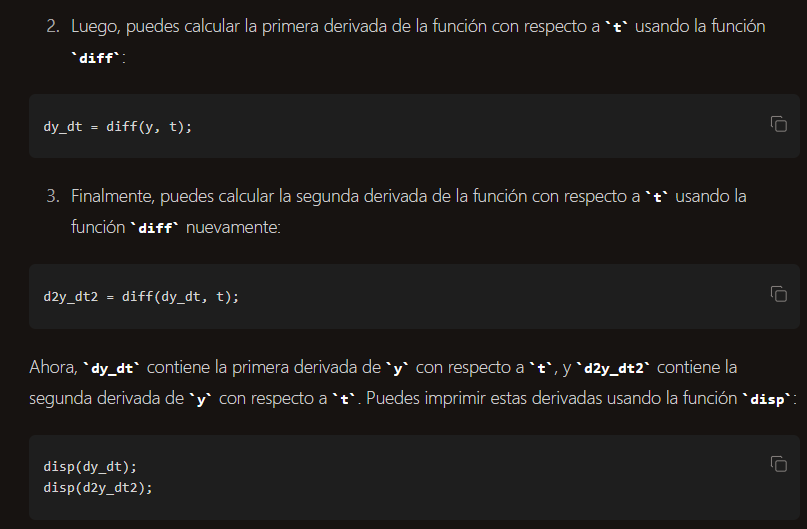

Aquí se encuentran las notas sobre todo el apartado de Derivación.

linspace(a, b, n) genera un vector de n puntos equiespaciados entre los valores a y b 

Nuestra linea: x = linspace(x0,xf, N+1);

**------------------**
como puedo tener derivadas simbolicas en OCTAVE, osea por ejemplo yo tengo declarado " y = @(t) 1/2 * (1 -exp(-2*t)); " y quiero tener por ej la derivada primera y segunda de eso, ¿como puedo hacer?

1. instalar el paquete Symbolic.
    1.1 esto se hace en la ventana de comandos de OCTAVE
    1.2 pkg install -forge symbolic 

2. importar en el proyecto "pgk load symbolic" 

Veamoslo con el ejemplo de la funcion de más arriba
__y = @(t) 1/2 * (1 -exp(-2*t));__

insert code: 

syms t;
y = 1/2 * (1 - exp(-2*t)); % usamos diff

